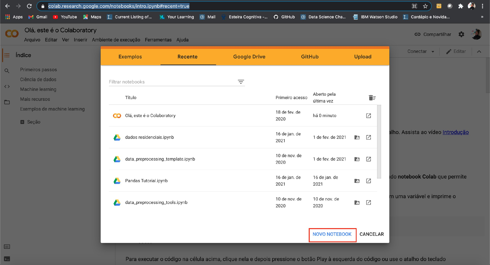
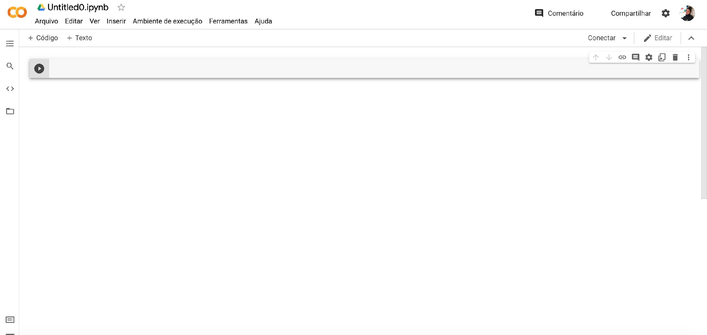

# Workshop de Machine Learning para Mulheres

Sejam bem vindas ao nosso workshop de Machine learning, esperamos bastante que aprendam e se divirtam junto conosco! Neste repositório você encontrará todos os materias que serão utilizados durante as aulas.

---

# Sumário
1. [Requisitos](#requisitos)
1. [Como abrir o Jupyter notebook usando o Anaconda?](#instalacao)
2. [ Tutorial Google Colab](#google-colab)

## Requisitos

1. [Python 3.6 ou maior](https://www.python.org/downloads/)
2. [Anaconda](https://docs.anaconda.com/anaconda/install/)
3. [Pip](https://pip.pypa.io/en/stable/installing/)

**Para acessar o tutorial que criamos para instalar essas ferramentas, [clique aqui.](https://docs.google.com/presentation/d/1a-daFACGDqUo9pcitdguZpBEmiD4KzVdswhK7H56KNs/edit?usp=sharing)**

*P.S: Caso você não conseguiu instalar um deles, poderá utilizar a versão online com o [Google Colab](https://colab.research.google.com/notebooks/intro.ipynb#recent=true)!*

---

## 2. Como abrir o Jupyter notebook usando o Anaconda?
Depois de ter instalado o Anaconda e o Python abra o app do anaconda. E siga os seguintes passos:

---

## 3. Tutorial Google Colab

O Google Colab fornece todo o ambiente que pedimos para vocês instalarem de forma online, portanto você não precisará instalara nada! Mas é necessário ter uma conta da Google

P.S: Para conhecer mais sobre o Google Colab, [clique aqui!](https://medium.com/@leonardopiechacaldeira/guia-explicativo-para-usar-o-google-colab-para-ciência-de-dados-86fc6458dd9c)
